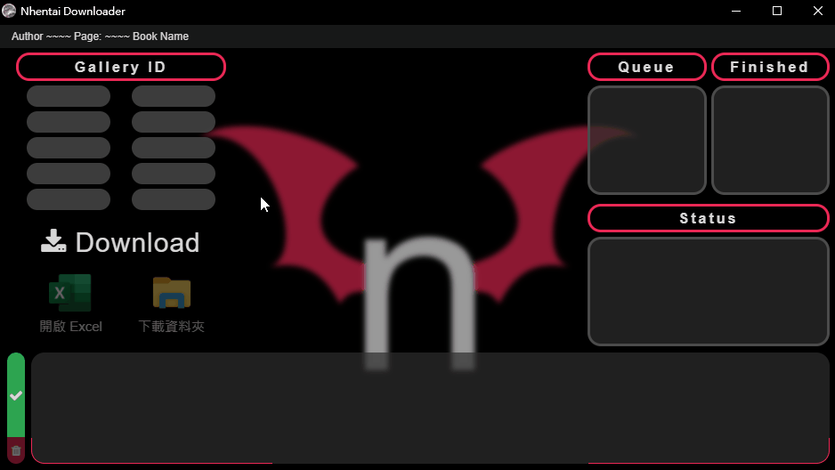

# Nhentai Downloader with GUI

這是一個有圖形化介面的 Nhentai 下載器，除了可以點擊圖片開啟下載資料夾外，也能透過 Excel 記錄每一本下載，並透過預覽封面告訴使用者目前正在下載哪一本。\
This is a downloader (only for Nhentai) with EEL. It will show the manga cover to let users know which one is downloading, also recording in Excel at the same time. After downloading, you can click the image to open the download folder to enjoy your "favorites".

> Eel is a little Python library for making simple Electron-like offline HTML/JS GUI apps, with full access to Python capabilities and libraries.\
> It hosts a local webserver, then lets you annotate functions in Python so that they can be called from Javascript, and vice versa.

一次最多下載 10 本，使用的是單執行續，且沒有協程或多執行續功能，所以下載速度偏慢。\
At most 10 books are downloaded for one time, and the speed may be a little bit slow...
The program is single processing rather than coroutine or multi processing.

# 演示 Demo

## 本程式存在以下幾點問題，使用前請先閱讀 ((目前暫不打算改進或繼續維護

The program has the known issues, be caution before using. ((It might not be fixed or maintained at the present stage.

1. `下載時關閉視窗，程式仍會繼續下載直到結束!!`\
   `The program will keep downloading even if close the window out.`

2. 目前只針對解析度為 1920 x 1080 做設計，在不同的解析度下可能會有跑版的問題。\
   I'm new for using Big3(HTML,CSS,JS), so I'm not sure how it show under different resolition.
3. 如果移動或刪除資料夾，程式會無法運作。\
   The program would crash if changed or removed any download folder.

4. 默認 Chrome 為瀏覽器，並以 Excel 紀錄每一本的下載。如果缺少其中一個，程式可能無法正常運作。\
   The default browser is Chrome, and record each download with Excel. The program might crash due to lack of both or one of them.

5. 因為是單執行緒，所以在下載時，點擊按鈕是無效的。\
   Because of single processing, click the button has no effect while downloading.

6. 輸入沒有去重，雖然不影響主要功能，但是回報結果可能會多顯示幾行。\
   The input doesn't have deduplication but the backend function has, it only influences the status result.

# 引用的庫 Import libraries

- os
- eel
- beautifulsoup
- xlwings
- fake_useragent
- requests

# 編輯時可能會遇到的問題 Else

**AttributeError: module 'eel' has no attribute 'XXXXX'**

> [Solve]\
> `npm run build` will rename variables and functions to minimize file size renaming `eel.expose(funcName)` to something like D.expose(J). The renaming breaks Eel's static JS-code analyzer, which uses a regular expression to look for `eel.expose(\*)`. To fix this issue, in your JS code, **convert all `eel.expose(funcName)` to `window.eel.expose(funcName, "funcName")`**. This workaround guarantees that 'funcName' will be available to call from Python.
